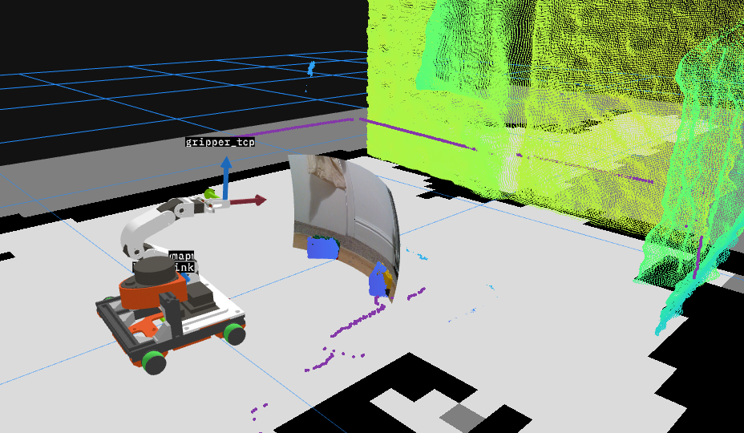

# Kiwi

My journey into building a robot from scratch, with the initial aim of exploring the Nav2 framework and mobile manipulation.

Kiwi is a small holonomic robot based around the NVIDIA Jetson Orin Nano with an Intel RealSense D435i RGB-D camera and RPLidar A1M8 lidar. Hardware is controlled by a Raspberry Pi 4, which drives a 3-DoF arm using Dynmixel Servos and a Pimoroni Motor2040 motor control board for the mecanum wheels.



# Packages

| Name | Description |
| :----: | --- |
|[`kiwi_bringup`](https://github.com/adamwhats/kiwi/tree/main/kiwi_description)|Contains the launch and configuration files.|
|[`kiwi_controller`](https://github.com/adamwhats/kiwi/tree/main/kiwi_controller)|The kinematic controller for mecanum wheels.|
|[`kiwi_description`](https://github.com/adamwhats/kiwi/tree/main/kiwi_description)|URDF xacros that describe the physical geometry and ros2_control interfaces.|
|[`kiwi_dockerfiles`](https://github.com/adamwhats/kiwi/tree/main/kiwi_dockerfiles)|Dockerfiles for both kiwi itself and teleop on a remote machine.|
|[`kiwi_hardware`](https://github.com/adamwhats/kiwi/tree/main/kiwi_hardware)|Hardware interface for driving the Motor2040 board. Written with lots of guidance from the excellent series by [Articulated Robotics](https://www.youtube.com/c/ArticulatedRobotics).|
|[`kiwi_teleop`](https://github.com/adamwhats/kiwi/tree/main/kiwi_teleop)|A launch file and rviz config for operating kiwi with a dualshock 4 controller (TODO).|

## Setup Notes
This is more for my benefit rather than anyone else
<details>
<summary> Jetson <-> Pi connection </summary>
Setup a local wired connection between the jetson and pi

On jetson:
```
# Remove old connections
sudo nmcli connection delete jetson-pi
# Create shared connection
sudo nmcli connection add type ethernet con-name jetson-pi ifname enP8p1s0 \
  ipv4.method shared ipv4.addresses 10.42.0.1/24 \
  connection.autoconnect yes
# Activate
sudo nmcli connection up jetson-pi
```

On pi:
> _*NOTE:*_ May need to disable netplan management of eth0 to prevent conflicts between it and NetworkManager
```
# Remove old connections
sudo nmcli connection delete jetson-pi
# Create shared connection
sudo nmcli connection add type ethernet con-name jetson-pi ifname eth0 \
  ipv4.method manual \
  ipv4.addresses 10.42.0.2/24 \
  ipv4.gateway 10.42.0.1 \
  ipv4.dns "8.8.8.8,8.8.4.4" \
  connection.autoconnect yes \
  connection.autoconnect-priority 100
# Activate
sudo nmcli connection up jetson-pi
```
</details>

<details>
<summary> Realsense udev rules </summary>
```
wget https://raw.githubusercontent.com/IntelRealSense/librealsense/master/config/99-realsense-libusb.rules
sudo mv 99-realsense-libusb.rules /etc/udev/rules.d/
sudo udevadm control --reload-rules && sudo udevadm trigger
```
</details>

<details>
<summary> Prevent lidar auto-spin </summary>
By default the RPLidar A1 begins spinning as soon as it is connected via USB. To prevent excessive wear, this service holds the RTS low to prevent this, but the ROS2 node is still able to take ownership of the port when launched.

Add udev rule to symlink the device to `/dev/rplidar`:
```
sudo tee /etc/udev/rules.d/99-rplidar.rules << 'EOF'
# RPLidar A1 - Create symlink
SUBSYSTEM=="tty", ATTRS{idVendor}=="10c4", ATTRS{idProduct}=="ea60", SYMLINK+="rplidar"
EOF

sudo udevadm control --reload-rules
sudo udevadm trigger
```

Create and enable the service:
```
sudo tee /usr/local/bin/rplidar-motor-off.py << 'EOF'
#!/usr/bin/env python3
import serial
import time
import sys

while True:
    try:
        ser = serial.Serial('/dev/rplidar', 115200, timeout=1)
        ser.rts = False
        while True:
            time.sleep(1)
    except serial.SerialException:
        time.sleep(1)  # Port busy (ROS2 using it), retry later
    except KeyboardInterrupt:
        sys.exit(0)
EOF

sudo chmod +x /usr/local/bin/rplidar-motor-off.py

sudo tee /etc/systemd/system/rplidar-motor-off.service << 'EOF'
[Unit]
Description=Keep RPLidar motor off when idle

[Service]
Type=simple
ExecStart=/usr/local/bin/rplidar-motor-off.py
Restart=always

[Install]
WantedBy=multi-user.target
EOF

sudo systemctl daemon-reload
sudo systemctl enable rplidar-motor-off.service
sudo systemctl start rplidar-motor-off.service
```

Purge the service if needed:
```
sudo systemctl stop rplidar-motor-off.service
sudo systemctl disable rplidar-motor-off.service
sudo rm /etc/systemd/system/rplidar-motor-off.service
sudo rm /usr/local/bin/rplidar-motor-off.py
sudo systemctl daemon-reload
sudo systemctl reset-failed
```
</details>

<details>
<summary> Building Docker container</summary>
Rtabmap takes a lot of RAM to build, and is more likely to be successful if additional swap memory is added, and is built via the Docker CLI rather than the devcontainer.
```
sudo fallocate -l 16G /swapfile
sudo chmod 600 /swapfile
sudo mkswap /swapfile
sudo swapon /swapfile
docker compose -f src/kiwi/compose.yaml build jetson
sudo swapoff /swapfile
sudo rm /swapfile
```
<details>